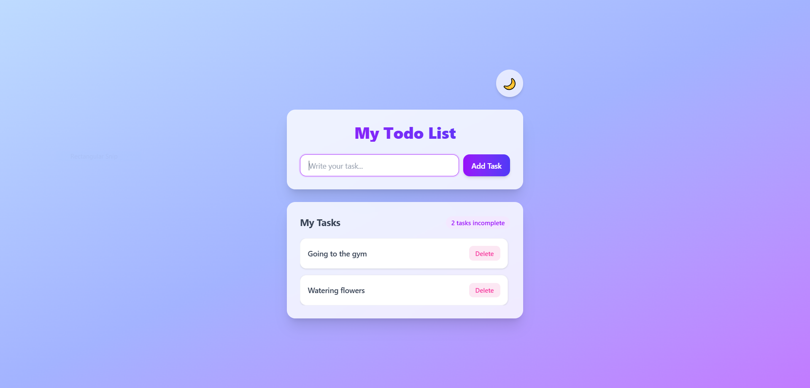
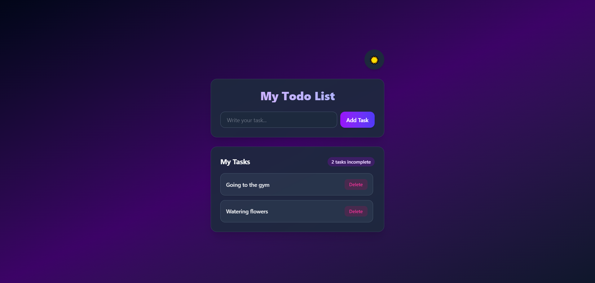

# Todo App

A simple and clean Todo application built with React and TypeScript.

## Features

- Add new todos
- Mark todos as completed
- Mark completed todos as active
- Delete todos
- Clean and simple user interface
- Responsive design

## 📸 Screenshots

### Light Mode



### Dark Mode



## Tech Stack

- React
- TypeScript
- HTML
- CSS
- Tailwind CSS

## Prerequisites

Make sure you have Node.js and npm installed on your computer.

## Getting Started

### 1. Install Dependencies

```bash
npm install
```

### 2. Run the Development Server

```bash
npm run dev
```

Open the local URL displayed in the terminal.

### 3. Build for Production

```bash
npm run build
```

## Main Files

- `App.tsx` – Main application component
- `todo.ts` – Defines the Todo type
- `TodoInput.tsx` – Component for adding new todos
- `TodoList.tsx` – Component for rendering the todo list
- `TodoItem.tsx` – Component for rendering an individual todo

Additional files are included in the project.

## Author

Kiana Avizeh

GitHub: https://github.com/kianavz2000


